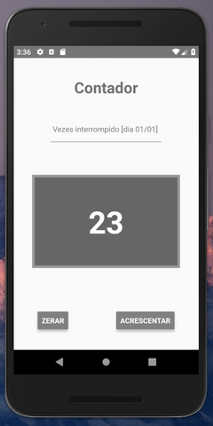

# Descrição

## Objetivo 

Esse APP foi desenvolvido em React Native.

O objetivo de desenvolver esse APP é praticar programação com esse framework.

## Funcionalidade

A funcionalidade acrescentar ou zerar o valor de um contador.

## Imagem

No exemplo abaixo, se está utilizando o APP para registrar a quantidade de vezes que se foi interrompido no dia * - *

